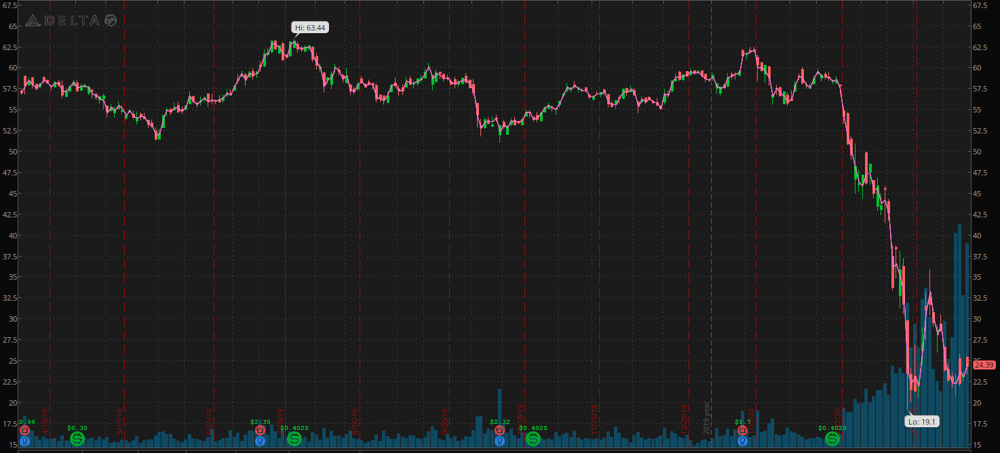

# Stocks Vs Corona

## Team - CAROLE BASKIN & THE COOL CATS

- Deshaune | djbailey20 | Bailey
- Efe | eogodo | Ogodo
- Chloe | chloezhao17 | Zhao
- Patrick | patrickhpatin | Patin
- Nene | baldenenette | Balde
- Patrick | herge008 | Hergenrother

## Chosen Topic

We will be analyzing airline and video conferencing stock market prices to see how they have changed due to the CoronaVirus pandemic.

## Data Sets

We will be using the yfinance python library to pull yahoo finance data and store it in a sql-lite server. [yfinance link](https://pypi.org/project/yfinance/)

## Visualizations

## Final Design Sketch

We will incoporate a dropdown list that allows the user to select the stocks they would like to see graphed. The user will also be able to input date ranges to view the stocks.

## [Github Page](https://github.com/djbailey20/stocks-vs-corona)
